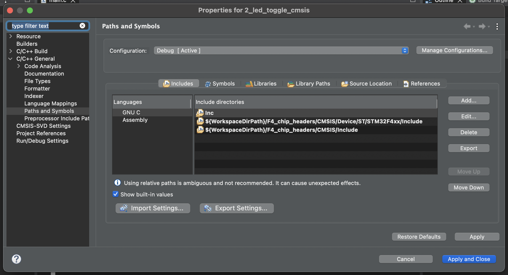
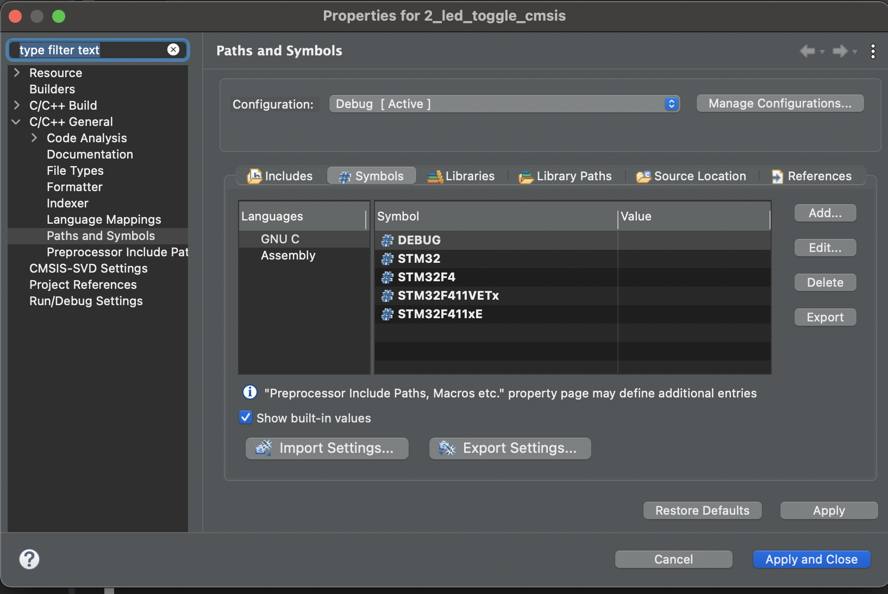

# Agregando CMSIS

## Agregando cmsis al proyecto
Se agrega el directorio del cmsis <br>


Se agrega la familia de microcontrolador<br>


Luego agregar la libreria.<br>
```C
#include "stm32f4xx.h"
```